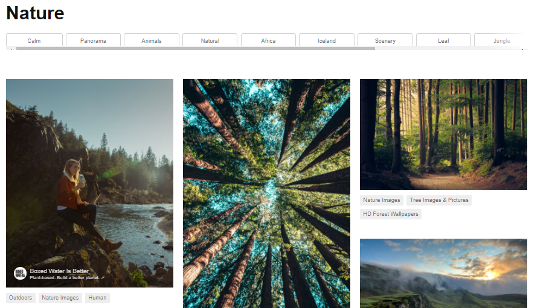
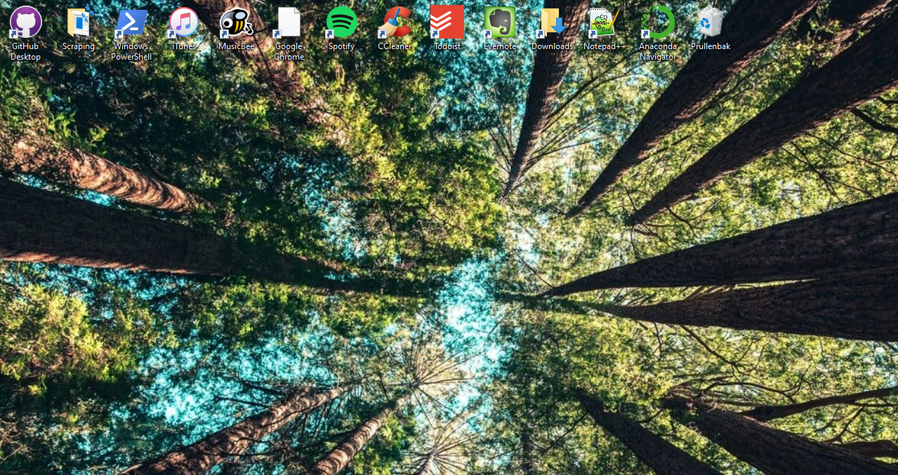

# Script to Automatically Download and Set Desktop Wallpaper
For my first independent project I've written a Python script that automatically downloads pictures from Unsplash.com

* Written a script that automatically downloads and sets a new desktop wallpaper for me everyday
* Using Selenium, the script opens Unsplash.com and searches for wallpapers by randomly selecting a searchterm from a list to add some variety
* The script then downloads the images using the selected searchterm (such as 'Nature' or 'Utrecht') 
* Finally, the script sets one of the downloaded images as my desktop background 
* Using a batch file and Windows Task Manager, this script is automatically executed daily 

